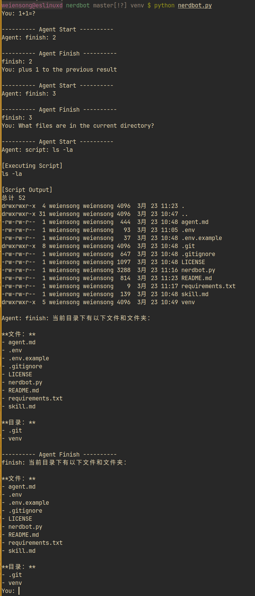

# nerdbot

一个用最简单方式展示 **Agent、Skill 和 LLM 如何协作** 的小项目。


---

## 介绍

### 说明:
  `nerdbot` 是一个最小实现，用来说明：

  - LLM：负责思考（理解 + 生成）
  - Skill：负责行动（工具 / API）
  - Agent：负责协调（什么时候用哪个）

### 本实现

  - LLM：OpenRouter model
  - Skill：wayland下的截图, 自然语言
  - Agent：如何执行shell命令, 自然语言
  - 简单的支持上下文: python list
  - shell命令执行: python subprocess run script by shell
---

## 使用

设置api key
```shell
export OPENROUTER_API_KEY="xxx..."
```

执行
```shell
python nerdbot.py
```

---
## Maintainers
[@touero](https://github.com/touero)

---
## License
[MIT](https://github.com/weiensong/nerdbot/blob/master/LICENSE)
